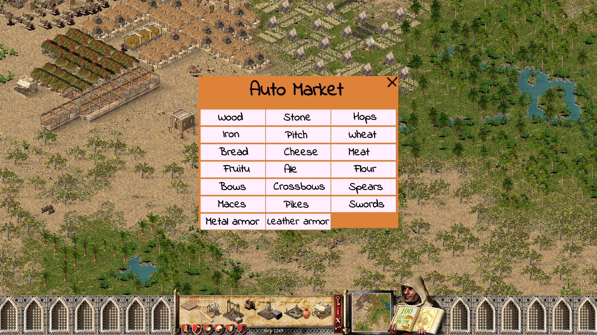

StrongMod allows you to create mods for Stronghold Crusader 1 V1.41 using Python.

## Auto Market Mod
Auto Market mod implemented using StrongMod, and it's included by default

## Installation:
1. Download Python (32-bit) version 3.8.10 or newer:
- Download it from: https://www.python.org/downloads/windows/
- Choose the Windows embeddable package (32-bit).
- Extract the contents to your game's installation path.

2. Download StrongMod:
- Get the latest version from: https://github.com/strongmods/StrongMod/releases
- Download the release package.
- Extract the contents to your game's installation path.

3. Run `start_game.bat`

## Notes:
- StrongMod is currently in development and may not have a complete set of features yet.
- StrongMod is not an official tool and is not affiliated with the creators of Stronghold Crusader 1.

## License
- StrongMod doesn't have a license yet.
- The code should only be used for modding purposes.